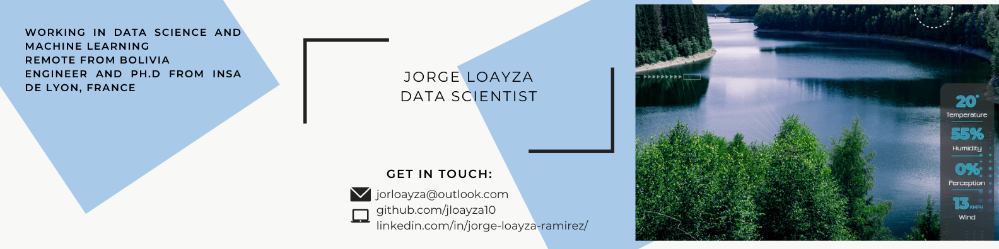

[]

<!--
**jloayza10/jloayza10** is a ✨ _special_ ✨ repository because its `README.md` (this file) appears on your GitHub profile.

  

### Hi there 👋

I'm Jorge, a Bolivian-French Engineer and Data Scientist. I've been learning all about data from visualization to ML model deployment with Python. I will be uploading the open projects I am working on.
I have 4+ years of experience working in the microelectronics industry, I have some contractor data analysis experience and am now looking for a full-time fully remote role in the data science world.

## Current Stats

